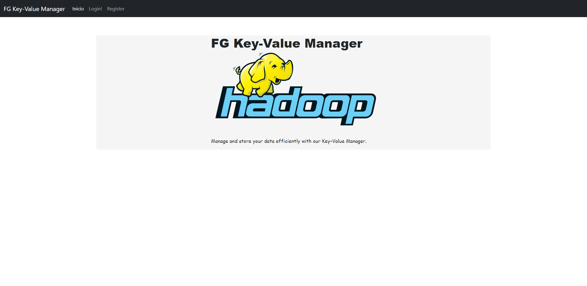
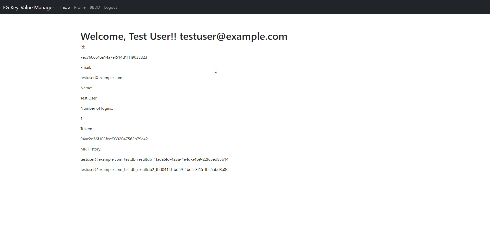
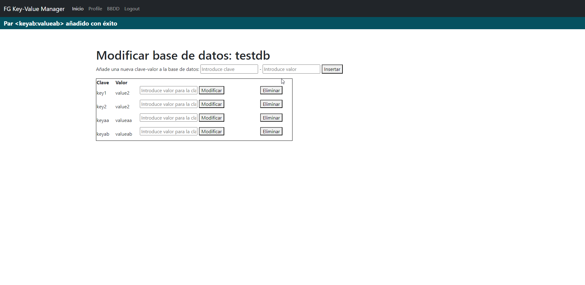
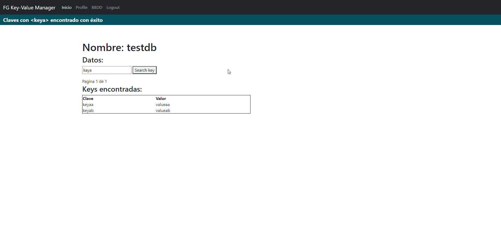
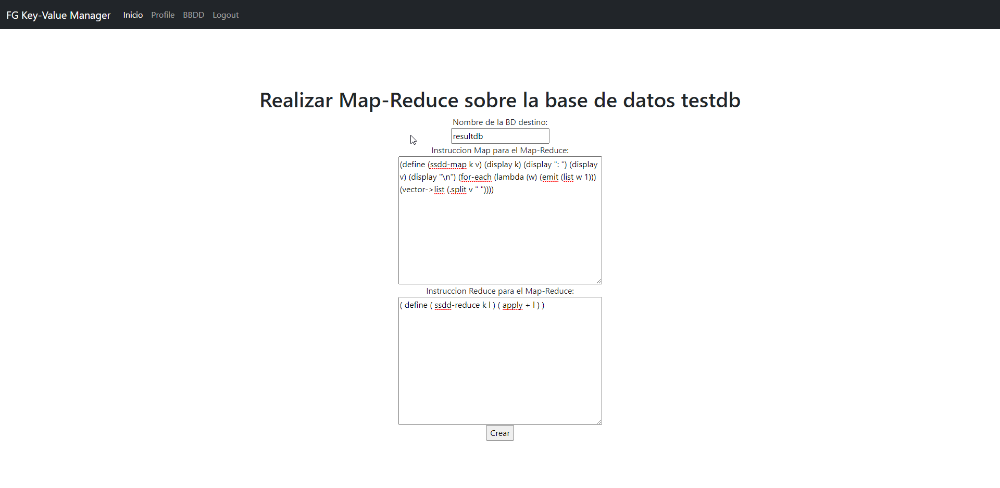
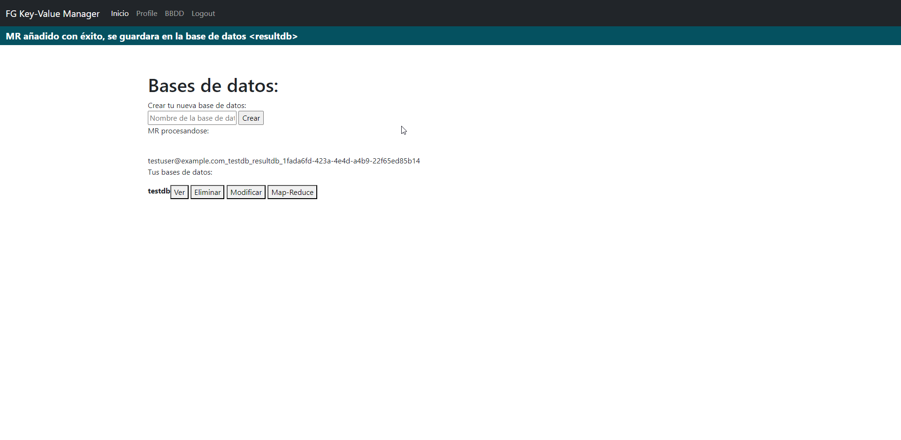
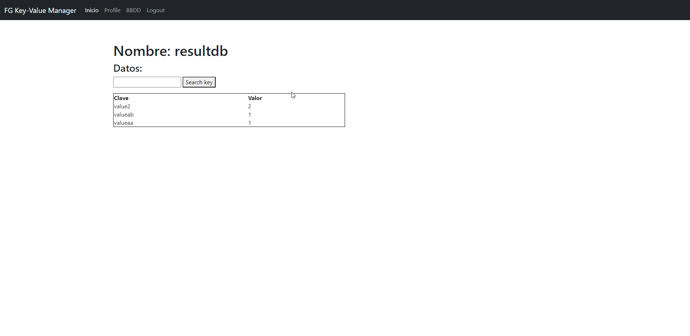

# :open_file_folder: FG Key Value Manager 
Código para la asignatura Sistemas Distribuidos de la UMU, curso 22-23.

# :arrow_forward: Ejecución
Para ejecutar el proyecto, ejecuta en la carpeta proyecto: 
````
make;
docker-compose -f docker-compose-devel-mongo.yml up;
````

Para ejecutar cuando se han realizado cambios en el código, ejecuta en la carpeta proyecto: 
````
make;
docker-compose -f docker-compose-devel-mongo.yml up --build;
````

# :hammer: Prueba
Probar poniendo en la terminal
`````
curl -v -XPOST -HContent-type:application/json -HAccept:application/json localhost:8080/Service/checkLogin --data '{"email": "dsevilla@um.es", "password": "admin"}'
`````
## :tv: Pruebas con el frontend
### Acceso
Acceder a la pagina http://localhost:5002/:


### Perfil
Tras registrar y loguear, se accede al perfil del usuario, donde se puede ver la información del usuario:


### DBs
En la seccion "BBDD" se pueden ver y crear bases de datos del usuaro.
Se puede incluir entradas en clave-valor clicando "Modificar" en la base de datos deseada:


Tras añadir ciertas entradas, podemos verlas en la sección "Ver", donde tambien se puede buscar por nombre de clave (organizando los resultados en páginas de 5 entradas):


### Map-Reduce

Al seleccionar "Map-Reduce" en una de las bases de datos, se puede realizar una peticion de map-reduce sobre esa BBDD del usuario con ayuda de un formulario.
Se puede usar estas intrucciones como ejemplo en el formulario, que contara **el numero valores repetidos en una base de datos**:
`````
(define (ssdd-map k v) (display k) (display ": ") (display v) (display "\n") (for-each (lambda (w) (emit (list w 1))) (vector->list (.split v " "))))
`````
`````
( define ( ssdd-reduce k l ) ( apply + l ) )
`````



Tras esperar a que se procese el map-reduce, cuando actualizemos la página, podremos ver la base de datos resultante:



# Docker Swarm y Stack
Para ejecutarlo en Swarm y Stack, tendremos que ejecutar lo siguiente:
`````
docker swarm init
`````
Cargamos el fichero para ejecutar los Dockers.
`````
docker-compose -f docker-compose-devel-mongo.yml up --build;
`````
Inicio se hace con docker swarm init.
`````
docker service create --name registry --publish published=5000,target=5000 registry:2
`````
Vemos aquí los Image ID
`````
docker image ls
`````
Asignamos a cada uno su tag
`````
docker tag 629535dcc91a 127.0.0.1:5000/ssdd-frontend

docker tag 45f89b6b3cf3 127.0.0.1:5000/db-mongo

docker tag 59cbe3732882 127.0.0.1:5000/backend-grpc

docker tag 80cd502ccb2c 127.0.0.1:5000/backend-restexterno

docker tag 071de23e71c4 127.0.0.1:5000/backend-rest
`````
Subimos cada contenedor.
`````
docker push 127.0.0.1:5000/ssdd-frontend

docker push 127.0.0.1:5000/db-mongo

docker push 127.0.0.1:5000/backend-grpc

docker push 127.0.0.1:5000/backend-rest

docker push 127.0.0.1:5000/backend-restexterno
`````

Tendremos que cambiar ahora el fichero del docker-compose.yml.

Y a continuación, se realizará el despliegue de la siguiente forma:
`````
docker stack deploy -c docker-compose-devel-mongo-swarm.yml ssdd
`````
